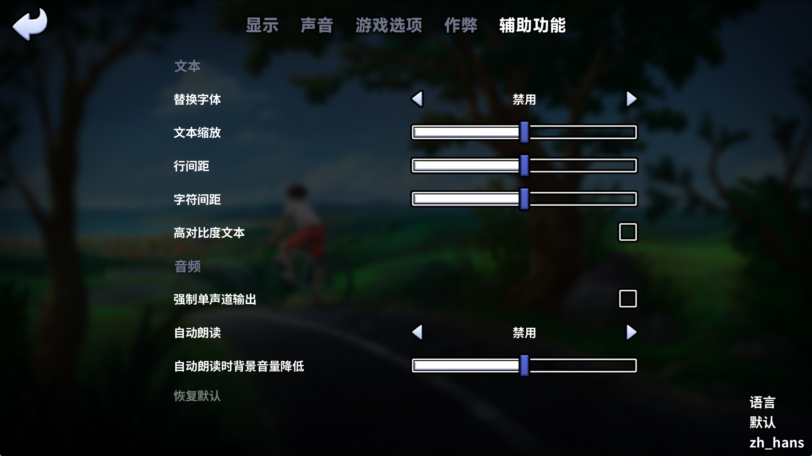

# 夏日传说 重制版（Summertime Saga v21）中文汉化补丁

[](LICENSE)
[](https://github.com/Mehael-Yeh/summertime-saga-chinese-translation/actions/workflows/build-chinese-rpa.yml)
[](https://github.com/Mehael-Yeh/summertime-saga-chinese-translation/releases/latest)
[](https://github.com/Mehael-Yeh/summertime-saga-chinese-translation/releases)

[Summertime Saga](https://summertimesaga.com/) 的非官方简体中文翻译项目，提供可直接安装的 `zh_hans.rpa` 汉化包，以及可供修改的 Ren'Py 翻译源文件。

> [!IMPORTANT]
> 当前翻译仅面向 **Summertime Saga v21 系列版本**。不同游戏版本的脚本和资源可能不兼容，安装前请确认版本并备份存档。

## :memo: 项目说明

- 翻译以机器翻译为基础，并持续进行人工校对、术语统一和剧情润色。
- 仓库只包含中文翻译、适配脚本和构建工具，**不包含游戏本体**。
- 翻译源文件位于 `tl/zh_hans/`，发布版汉化包名为 `zh_hans.rpa`。
- 项目内置默认切换为中文、语言入口和短信界面适配等辅助脚本。
- 翻译仍在完善中，可能存在错译、漏译、语气不一致或版本兼容问题。
- 汉化包内置`tl/zh_hans/sex_speed_control.rpy` 仿原版（v0.20.16）速度控制Mod。

## :arrow_down: 安装方法

请只选择以下一种安装方式，避免 `zh_hans.rpa` 与散装的 `tl/zh_hans` 文件重复加载。

### :star: 方法一：安装 `zh_hans.rpa`（推荐）

1. 从项目的 [Releases](https://github.com/Mehael-Yeh/summertime-saga-chinese-translation/releases) 页面[下载](https://github.com/Mehael-Yeh/summertime-saga-chinese-translation/releases/latest)对应版本的 `zh_hans.rpa`。
2. 完全退出游戏。
3. 将 `zh_hans.rpa` 放入游戏根目录下的 `game` 文件夹。
4. 启动游戏并确认界面与对话已切换为中文。

```text
SummertimeSaga/
└── game/
    └── zh_hans.rpa
```

### :package: 方法二：安装翻译源文件

此方式适合需要自行修改译文或参与翻译的用户。

1. [下载](https://github.com/Mehael-Yeh/summertime-saga-chinese-translation/releases/latest)或克隆本仓库。
2. 将仓库中的整个 `tl` 文件夹复制到游戏的 `game` 文件夹中。
3. 合并目录时保留 `tl/zh_hans/` 的完整结构。

```text
SummertimeSaga/
└── game/
    └── tl/
        └── zh_hans/
            ├── base_box/
            ├── fonts/
            ├── res/
            ├── src/
            ├── sex_speed_control.rpy
            ├── hook_add_change_language_entrance.rpy
            ├── bytecode_strings.rpy
            ├── sms_fix.rpy
            └── set_default_language_at_startup.rpy
```

## :arrows_counterclockwise: 更新与卸载

- **更新：** 退出游戏，删除旧版 `zh_hans.rpa` 后再复制新版文件；使用源文件安装时，请先删除旧的 `game/tl/zh_hans/`，再复制新版本。
- **卸载：** 删除 `game/zh_hans.rpa`，或删除手动安装的 `game/tl/zh_hans/`。
- 如果卸载后仍显示中文，请在游戏设置中切换语言，并清理可能遗留的重复汉化文件。

## 	:open_file_folder: 仓库结构

```text
.
├── .github/workflows/       # GitHub Actions 自动构建与发布
├── assets/                  # 截图示例素材
├── tl/zh_hans/              # Ren'Py 简体中文翻译源文件（内含sex_speed_control.rpy仿原版速度控制Mod）
├── tools/                   # 校验、术语审计和 RPA 构建工具
├── translation_context/     # 角色、剧情、术语、风格和精修进度记录
├── LICENSE
└── README.md
```

<details>
<summary><h2>:framed_picture: 截图示例</h2></summary>
    




</details>

## :handshake: 参与贡献

欢迎通过 [Issues](https://github.com/Mehael-Yeh/summertime-saga-chinese-translation/issues) 报告错译、漏译、兼容问题或术语建议，也欢迎提交 Pull Request。

提交翻译前请注意：

1. 先阅读风格指南、术语表和相关角色资料。
2. 只修改译文字符串，不要改动 Ren'Py 标签、变量、占位符或程序结构。
3. 保持文件原有编码、换行形式和行数结构。
4. 对连续剧情文件结合上下文复核，避免逐句孤立翻译。
5. 提交前运行“本地校验”中的命令，并说明适配的游戏版本和测试结果。

## :warning: 免责声明

本项目是社区维护的非官方汉化，与 Summertime Saga 官方及其开发团队无隶属或授权关系。游戏名称、原始文本、美术、音频及其他游戏资源的权利归其各自权利人所有。本仓库不提供游戏本体；请通过官方渠道获取游戏，并遵守所在地法律法规。

## :balance_scale: 许可证

本仓库中的原创代码与工具按 [`LICENSE`](LICENSE) 中的 MIT License 提供。该许可证不授予对 Summertime Saga 原始内容、商标或其他第三方素材的任何权利。
