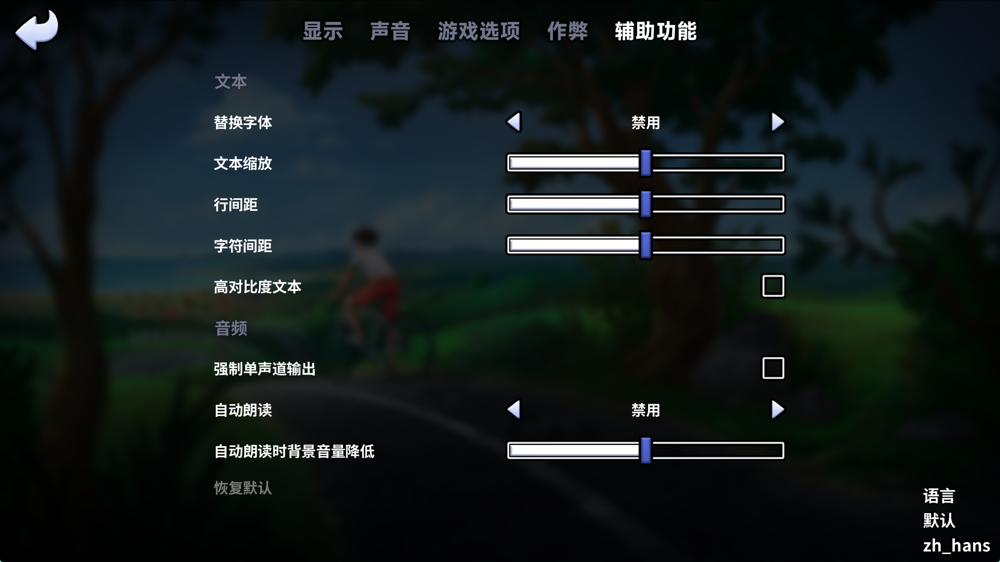

# 夏日传说 重制版（Summertime Saga v21）中文汉化补丁

[](LICENSE)
[](https://github.com/Mehael-Yeh/summertime-saga-chinese-translation/actions/workflows/build-chinese-rpa.yml)
[](https://github.com/Mehael-Yeh/summertime-saga-chinese-translation/releases/latest)
[](https://github.com/Mehael-Yeh/summertime-saga-chinese-translation/releases)

[Summertime Saga](https://summertimesaga.com/) 的非官方简体中文翻译项目，提供可直接安装的 `zh_hans.rpa` 汉化包，以及可供修改的 Ren'Py 翻译源文件。

> [!IMPORTANT]
> 当前翻译仅面向 **Summertime Saga v21 系列版本**。不同游戏版本的脚本和资源可能不兼容，安装前请确认版本并备份存档。

## :memo: 项目说明

- 翻译以机器翻译为基础，并持续进行人工校对、术语统一和剧情润色。
- 仓库源码不包含游戏本体；部分 GitHub Releases 会另附对应版本的 PC 游戏压缩包，是否随附及适配版本以具体发行页为准。
- 翻译源文件位于 `tl/zh_hans/`，发布版汉化包名为 `zh_hans.rpa`。
- 项目内置默认切换为中文、语言入口和短信界面适配等辅助脚本。
- 翻译仍在完善中，可能存在错译、漏译、语气不一致或版本兼容问题。
- 汉化包内置 `mods/` 中的仿原版（v0.20.16）动画调速 Mod、角色图鉴解锁／取消解锁 Mod 和控制说明 Mod（新增功能需使用包含该改动的新构建包）。

## :arrow_down: 安装方法

请只选择以下一种安装方式，避免 `zh_hans.rpa` 与散装的 `tl/zh_hans` 文件重复加载。

### :star: 方法一：安装 `zh_hans.rpa`（推荐）

1. 从项目的 [Releases](https://github.com/Mehael-Yeh/summertime-saga-chinese-translation/releases) 页面[下载](https://github.com/Mehael-Yeh/summertime-saga-chinese-translation/releases/latest)对应版本的 `zh_hans.rpa`。
2. 完全退出游戏。
3. 将 `zh_hans.rpa` 放入游戏根目录下的 `game` 文件夹。
4. 启动游戏并确认界面与对话已切换为中文。

```text
SummertimeSaga/
└── game/
    └── zh_hans.rpa
```

### :package: 方法二：安装翻译源文件

此方式适合需要自行修改译文或参与翻译的用户，或者希望拿到**最新手动翻译**的用户。

1. [下载](https://github.com/Mehael-Yeh/summertime-saga-chinese-translation/archive/refs/heads/main.zip)或克隆本仓库。
2. 将仓库中的整个 `tl` 文件夹复制到游戏的 `game` 文件夹中；如需内置 Mod，同时将 `mods` 文件夹复制到 `game` 中。
3. 合并目录时保留 `tl/zh_hans/` 的完整结构。

```text
SummertimeSaga/
└── game/
    ├── mods/
    │   ├── sex_speed_control/
    │   │   └── sex_speed_control.rpy
    │   ├── cookie_jar_unlock/
    │   │   └── cookie_jar_unlock.rpy
    │   └── controls_guide/
    │       └── controls_guide.rpy
    └── tl/
        └── zh_hans/
            ├── base_box/
            ├── fonts/
            ├── res/
            ├── src/
            ├── hook_add_change_language_entrance.rpy
            ├── bytecode_strings.rpy
            ├── sms_fix.rpy
            └── set_default_language_at_startup.rpy
```

## :joystick: 内置Mod说明

| Mod | 入口与功能 | 详细说明 |
| --- | --- | --- |
| 动画调速 | 动画播放界面调整播放速度 | [安装与使用](mods/sex_speed_control/README.md) |
| 角色图鉴解锁 | 图鉴右上角锁按钮；点击解锁，再次点击恢复正常剧情解锁状态 | [安装、取消解锁与兼容性](mods/cookie_jar_unlock/README.md) |
| 控制说明 | 设置→控制；滚动表格列出14项通用按键、5项小游戏操作及限制说明，支持英文／中文切换 | [安装、使用与卸载](mods/controls_guide/README.md) |

控制说明只显示帮助，不更改键位。方向键用于选择按钮，不用于移动人物；部分场景仍需鼠标。当前已验证8194 PC版，未来游戏更新须重新核对按键和设置布局。触屏版保留原有控制页，新Mod入口显示“键盘 / Keyboard”；触屏布局尚未验收。

使用包含Mod的`zh_hans.rpa`时，不要再安装同名散装Mod。已有发行包不会因仓库更新自动变化，新增功能需下载重新构建的包；源文件安装可直接复制对应Mod目录。

## :arrows_counterclockwise: 更新与卸载

- **更新：** 退出游戏，删除旧版 `zh_hans.rpa` 后再复制新版文件；使用源文件安装时，请先删除旧的 `game/tl/zh_hans/`，再复制新版本。
- **卸载：** 删除 `game/zh_hans.rpa`，或删除手动安装的 `game/tl/zh_hans/`。
- 使用源文件安装 Mod 时，更新前删除旧的 `game/`、`game/tl/zh_hans/` 或 `game/mods/` 根目录中的同名 Mod 脚本及 `.rpyc`，避免重复加载；卸载 Mod 时删除对应的 `game/mods/sex_speed_control/`、`game/mods/cookie_jar_unlock/` 或 `game/mods/controls_guide/` 子文件夹。卸载控制说明前先切换到“显示”等原有设置页，再退出游戏；卸载图鉴Mod前可先点击锁按钮恢复正常解锁状态。
- 如果卸载后仍显示中文，请在游戏设置中切换语言，并清理可能遗留的重复汉化文件。

## 	:open_file_folder: 仓库结构

```text
.
├── .github/workflows/       # GitHub Actions 自动构建与发布
├── assets/                  # 截图示例素材
├── mods/                    # 动画调速、角色图鉴解锁与控制说明 Mod
│   ├── sex_speed_control/
│   │   ├── sex_speed_control.rpy
│   │   └── README.md         # 调速 Mod 安装及使用说明
│   ├── cookie_jar_unlock/
│   │   ├── cookie_jar_unlock.rpy
│   │   └── README.md         # 图鉴 Mod 安装及兼容说明
│   └── controls_guide/
│       ├── controls_guide.rpy
│       └── README.md         # 控制说明 Mod 安装及使用说明
├── tl/zh_hans/              # Ren'Py 简体中文翻译源文件及界面适配脚本
├── tools/                   # 校验、术语审计和 RPA 构建工具
├── translation_context/     # 角色、剧情、术语、风格和精修进度记录
├── LICENSE
└── README.md
```

<details>
<summary><h2>:framed_picture: 截图示例</h2></summary>
    




</details>

## :handshake: 参与贡献

欢迎通过 [Issues](https://github.com/Mehael-Yeh/summertime-saga-chinese-translation/issues) 报告错译、漏译、兼容问题或术语建议，也欢迎提交 Pull Request。

提交翻译前请注意：

1. 先阅读风格指南、术语表和相关角色资料。
2. 只修改译文字符串，不要改动 Ren'Py 标签、变量、占位符或程序结构。
3. 保持文件原有编码、换行形式和行数结构。
4. 对连续剧情文件结合上下文复核，避免逐句孤立翻译。
5. 提交前运行“本地校验”中的命令，并说明适配的游戏版本和测试结果。

## :warning: 免责声明

本项目是社区维护的非官方简体中文汉化，与 Summertime Saga 官方及其开发团队无隶属或授权关系。GitHub Releases 的部分发行版会附有与汉化包匹配的 PC 游戏本体压缩包，是否随附及适配版本以对应发行说明为准。游戏本体、名称、商标、原始文本、美术、音频及其他游戏素材的权利归 Kompas Productions 及相应权利人所有；本项目发行页提供下载不代表这些内容纳入本项目许可证，也不构成额外授权。请通过[官方渠道](https://summertimesaga.com/)了解和获取游戏；下载或使用发行页中的游戏本体附件前，请自行确认适用许可并遵守所在地法律法规。

## :balance_scale: 许可证

本仓库中的原创代码与工具按 [`LICENSE`](LICENSE) 中的 MIT License 提供。该许可证不适用于发行页附带的游戏本体，也不授予对 Summertime Saga 原始内容、商标或其他第三方素材的任何权利。
